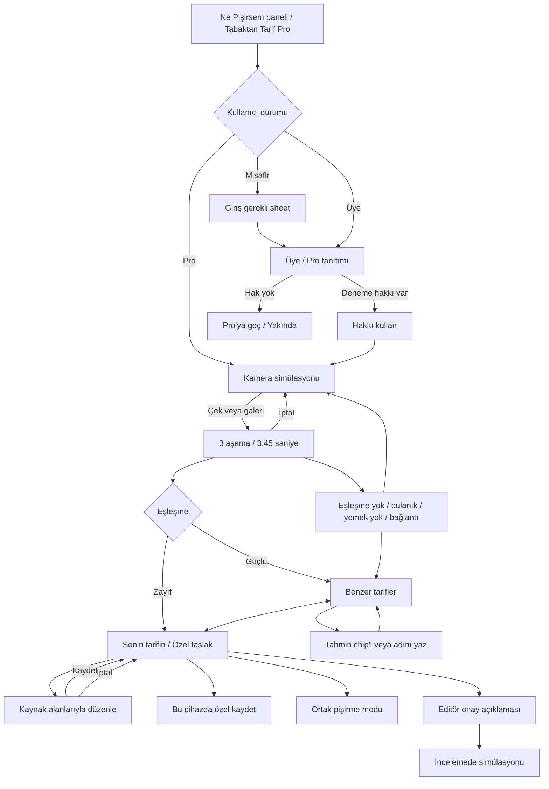

# Tabaktan Tarif (Pro) — yerel mobil tasarım

Onaylı web-dışı özellik. Kamera, tanıma, taslak üretimi, giriş, deneme hakkı ve editör başvurusu simülasyondur. Hiçbir istek üretim sunucusuna yazılmaz. Yalnız mevcut gerçek tarif veri seti örnek çıktı olarak kullanılır. Benzer tarifler denenmiş içeriktir; kullanıcının kopyası özel ve sürekli `Taslak · Yapay zekâ ile oluşturuldu` etiketlidir. Başvuru önizlemesinde `İncelemede · Yapay zekâ ile oluşturuldu` olur.

## Akış

## Kaynak-transfer

- `resources/views/tarif-ekle/index.blade.php`: ad/kategori/açıklama123–154; fotoğraf210; video228; porsiyon ve süre258–266; zorluk272; mutfak283; fırın291; adımlar331–338.
- `public/reference/tarif-ekle/tarif-ekle.js:551–570`: gerçek gönderim alanları. Form verisiyle backend taslağı aşağıdaki tabloda ayrılır.
- Pro rozet: `resources/css/tokens.css:2172 .pg-tag`, domates + domates-tint + crown. Renk ve isim aktarılmış; webdeki999px radius yerine mobil kontrol12px kullanılmıştır.
- `resources/views/abonelik/_pro-gate.blade.php`: Pro kapısı ailesi. Canlı `/pro` okuması `docs/pro-canli-kaynak.txt`. Fiyat/süre/paket bilgisi arayüze eklenmedi.
- Paket durumları `app/Support/ProfileMenu.php`; yerel web ile canlı hesap menüsü farklı olduğundan Pro satın alma hedefi “Yakında”.

## Düzenleme alanları ve veri eşleşmesi

| Mobil alan | Kaynak alan / kontrat | Not |
|---|---|---|
| Fotoğraf | upInput / cover, gallery | Örnek galeri fotoğrafı; gerçek yükleme yok |
| Ad | fTitle / title | Kullanıcı düzenler |
| Açıklama | fDesc / description | Kaynak metin |
| Kategori (çoklu) | msCat / category_ids | Prototip ad tutar; gerçek API ID ister |
| Mutfak (çoklu) | msCuisine / cuisine_ids | Virgüllü ad girişi; ID eşleştirme backend işi |
| Beslenme / Tip | fTypes / diet_tag_ids | Yerel metin; gerçek taxonomy ID gerektirir |
| Porsiyon | fServ / servings | Pozitif sayı |
| Hazırlık / pişirme | fPrep, fCook / prep_time_min, cook_time_min | Kaynak künye ayrımından alınır; toplam yeniden hesaplanır |
| Zorluk | fDiff / difficulty | Kolay/Orta/Zor; enum eşlemesi API'de |
| Fırın sıcaklığı | fHeat / oven_temp_c | İsteğe bağlı |
| Video | fVideo / video_url | İsteğe bağlı |
| Malzemeler | ingredients | Ad, miktar, birim, not; ekle/sil/yukarı/aşağı |
| Adımlar | steps | Başlık, metin, süre, örnek görsel; ekle/sil/sırala |
| Püf noktası / etiketler | Talimatta istenen ek taslak alanları | Okunan collectPayload içinde bağımsız alan yok; backend eşlemesi kararlaştırılmalı |
| Abonelere özel | subscribers_only | Özel taslakta herkes için private=true; bu yayın görünürlüğü taslak formunda açılmaz |
| Besin | nutrition + estimated=true | Var olan tarifin örnek değerleri, tahmini etiketi |
| AI / sahiplik | ai_generated=true, owner_id, visibility=private | Kullanıcı taslağı denenmiş tariften ayrı kayıt |

## Backend'den beklenenler — taslak kontrat, uygulanmış API değil

**İstek:** authenticated user, image upload ID, locale, idempotency key, recognition job ID; isteğe bağlı correction text/ingredient IDs. Fotoğrafın MIME/boyut doğrulaması ve sahiplik kontrolü sunucuda.

**Haklar:** `is_pro`, `can_use`, `trial_total`, `trial_remaining`, `daily_remaining`, `resets_at`, `limit_reason`. Prototipte3 hak yalnız talimattaki senaryodur, fiyat veya gerçek paket kotası değildir. Hak düşümü üretimde atomik ve tekrar isteğe dayanıklı olmalıdır.

**Tanıma yanıtı:** job/status, recognized name, confidence enum(high/medium), alternative guesses, ingredient IDs/names, matching recipe IDs + reason. Tarif içerikleri sunucudaki denenmiş kayıtlardan gelir.

**Taslak yanıtı:** private draft ID/version, owner ID, source image ID, AI etiketi, title/description/taxonomies, times/servings/difficulty, ingredients (amount/unit/note/substitutes), steps (body/duration/images), estimated nutrition, tags/tips, uncertainty notices. Üretim başarısızsa benzer tarifler yine kullanılabilir.

**Kaydet/düzenle:** sahiplik kontrolü, optimistic version, validation errors; tarif-ekle alanlarıyla aynı sözleşme. **Onaya gönder:** private draft → pending review; onaylı denenmiş tarif listesine doğrudan ekleme yok. Silme yalnız kullanıcının özel taslağını etkiler.

**Hatalar:** no_match, no_food, blurry, permission_denied, network, generation_failed, login_required, daily_limit, trial_exhausted. Kamera ayarları/giriş/ödeme prototipte gerçek cihaz servisi değildir.

## Flutter notları

Kamera ve galeri native camera/image_picker karşılıklarıyla; kamera/analiz ekranları ayrı route, sonuç/düzenleme state machine ile. Kamera izin yaşam döngüsü ve app resume ele alınır. Analiz iptali job cancellation'a bağlanır. Bottom sheet, segment, kart, header, malzeme ve pişirme bileşenleri ortak kalır. SafeArea + dinamik ekran ölçüsü; 360/390/430 doğrulaması. Reduced motion, erişilebilir adlar ve başparmak hedefleri korunur. Prototipteki localStorage üretimde kullanıcıya özel güvenli backend kaydının yerine geçmez.

## Kanıt ve sınırlar

16 durum: `docs/tabaktan-durum-test.json`; ana etkileşim zinciri: `docs/tabaktan-etkilesim.json`; 3× bileşenler `docs/screenshots/polish/tabaktan-*-3x.png`. Ekranlar `tabaktan-{durum}.png`. Gerçek kamera, AI, auth, ödeme, upload veya editör kuyruğu uygulanmadı. Kaynak formun çoklu taxonomy ID seçicisi prototipte ad temelli; entegrasyonda gerçek taxonomy seçici kullanılmalı.

## Tam durum bağlantıları

[18 durumun doğrudan bağlantısı](20-baslik-ve-durum-denetimi.md). Yayınlama sheet’i ve İncelemede doğrudan önizlenebilir.

## Orta düğme kararı ve ortak eylem kartı
Orta düğme tüm kullanıcı türlerinde **Ne Pişirsem** kalır; varsayılan Pro değildir. Üç seçenekli **Tarif bul** paneli açar. Pro üye için bile doğrudan kameraya dönüşmez. Yerel Tabaktan Tarif satırı mevcut Pro kapısına gider; üç ekranlık yayında aynı satır yalnız Yakında bildirir.

Panel, paylaş/işlemler/giriş ve yeniden çek–adını yaz–malzemeyle ara seçenekleriyle aynı eylem kartını kullanır. Açıklamalar tek satır, taşanı üç nokta. Ana sayfa widget’ı, arama kamera ikonu ve çekmece girişine ilişkin bu mesajda ayrıntısı bulunmayan önceki tasarım maddeleri yeniden yorumlanarak eklenmedi; mevcut bileşenler korunur.

## Canlı prototip yayını
Son kullanıcı onayıyla Tabaktan Tarif de yayın paketine dahil. Yayın HTML’inde `data-demo-pro=true`: engelsiz Pro simülasyonu, gerçek kamera/izin isteği yok. Yerel varsayılan ve durum bağlantıları değişmedi. Canlıda `uye/durum` parametreleri Pro/deneme kapısını açmaz; geliştirici önizleme sayfası yayınlanmaz.

Geri akışı: düzenleme → taslak; benzer tarifin detayı → korunmuş sonuç ekranı; kamera kapat → giriş yapılan Ana Sayfa/Tarif Listesi. Kaydet yalnız bu cihazın localStorage alanına özel taslak yazar; gerçek backend/AI/editor kuyruğu değildir.
